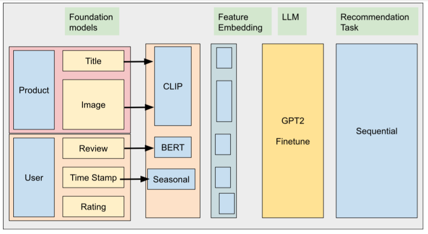

# **A Multimodal Recommender System for Dynamic E-Commerce Personalization Using Foundation Models and LLM**  

## **Overview**  
This repository contains the implementation and research work for my master’s project, which focuses on developing a multimodal recommender system to enhance e-commerce personalization. The project leverages foundation models and large language models (LLMs) to integrate diverse data modalities, including text, images, numerical data, and timestamps, to deliver dynamic, context-aware recommendations.

## **Research Problem**  
The research addresses the challenge of capturing temporal dynamics and user preferences across multiple modalities. It focuses on:  
1. Incorporating timestamps as a modality to account for seasonal trends and celebrations.  
2. Integrating user context, such as behavior, session data, and location, for more accurate recommendations.  
3. Improving sequential prediction capabilities in multimodal systems to adapt to evolving customer preferences.

## **Objectives**  
- Develop a multimodal foundation model incorporating text (e.g., reviews), images, numerical data, and timestamps.  
- Enhance personalization using sequential prediction algorithms to track short-term and long-term user preferences.  
- Evaluate the model's performance on the **Amazon Review Dataset** using metrics like recall, precision, and F1-score.  

## **Key Features**  
- **Foundation Models**: Utilizes CLIP for image-text embedding and GPT-2 for sequential prediction.  
- **Temporal Dynamics**: Incorporates timestamps to adapt recommendations to seasonal trends and events.  
- **Multimodal Data**: Combines product images, reviews, ratings, and temporal information for enhanced recommendations.  
- **Personalization**: Focuses on dynamic user profiling to deliver tailored recommendations over time.

## Proposed architecture

## **Implementation Details**  
1. **Dataset**:  
   - **Source**: Amazon Review Dataset.  
   - **Preprocessing**: Includes cleaning, annotating, and adding timestamp features for trend analysis.  

2. **Model Architecture**:  
   - **Embedding**: CLIP for image and text embeddings.  
   - **Sequential Prediction**: GPT-2 for understanding user interaction sequences.  
   - **Temporal Integration**: Added timestamps as a new modality to existing embeddings.  

3. **Frameworks and Tools**:  
   - Python (PyTorch, TensorFlow, Transformers)  
   - Hugging Face for foundation models  
   - Weights & Biases (WandB) for tracking experiments  
   - Pandas, NumPy, and Scikit-learn for data analysis and preprocessing  

4. **Evaluation Metrics**:  
   - Hit Rate (HR): Measures how often the recommended items include the relevant item.  
   - NDCG (Normalized Discounted Cumulative Gain): Evaluates the ranking quality by assigning higher scores to relevant items at the top of the recommendation list.
   - MRR (Mean Reciprocal Rank): Calculates the reciprocal rank of the first relevant item in the recommendation list.
   - MAP (Mean Average Precision): Measures the average precision across all recommendation lists.
